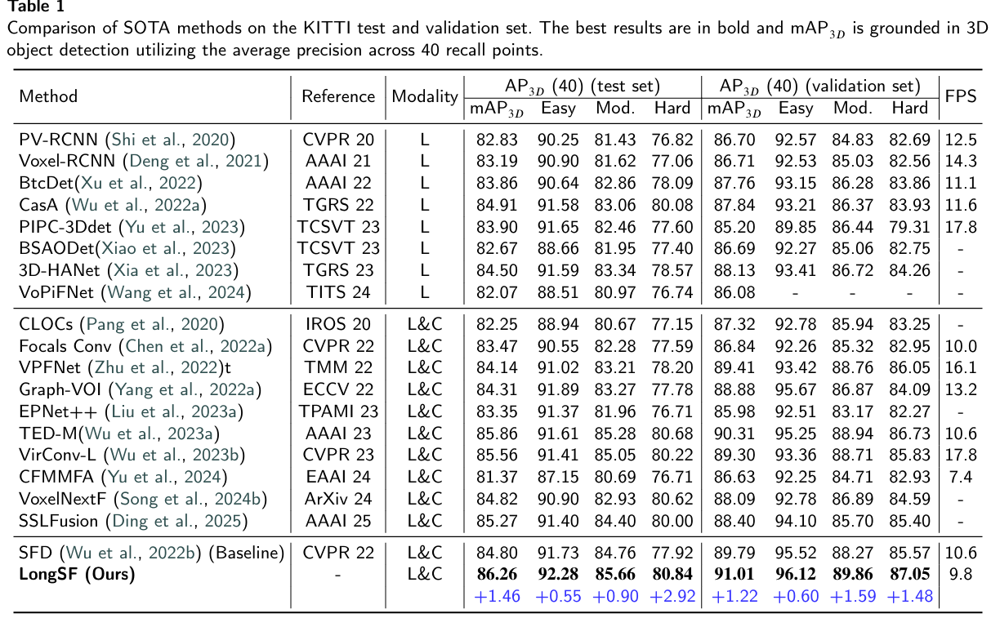

# LongSF
This is the official version of LongSF. LongSF is mainly used for multimodal 3D object detection with SSMs, and we conduct experiments on nuScenes and KITTI datasets.


* **Strong performance**. LongSF achieves **SOTA** performance on kitti test set for single-use data. [`KITTI Benchmark`](https://www.cvlibs.net/datasets/kitti/eval_object.php?obj_benchmark=3d)💪

## Evaluation results on the KITTI benchmark
<figure>
  
  <figcaption style="text-align: center;"></figcaption>
</figure>

## Evaluation results on the nuScenes benchmark
<figure>
  
  <figcaption style="text-align: center;"></figcaption>
</figure>


### Installation
1.  Prepare for the running environment. 

    You can  follow the installation steps in [`OpenPCDet`](https://github.com/open-mmlab/OpenPCDet). We use 1 RTX-3090 or 4 RTX-4090 GPUs to train our LongSF.

2. Prepare for the data.  
    
    The dataset is follow [`SFD`](https://github.com/LittlePey/SFD). Anyway, you should have your dataset as follows:

    ```
    MPCF
    ├── data
    │   ├── kitti_pseudo
    │   │   │── ImageSets
    │   │   │── training
    │   │   │   ├──calib & velodyne & label_2 & image_2 & (optional: planes) & depth_dense_twise & depth_pseudo_rgbseguv_twise
    │   │   │── testing
    │   │   │   ├──calib & velodyne & image_2 & depth_dense_twise & depth_pseudo_rgbseguv_twise
    │   │   │── gt_database
    │   │   │── gt_database_pseudo_seguv
    │   │   │── kitti_dbinfos_train_custom_seguv.pkl
    │   │   │── kitti_infos_test.pkl
    │   │   │── kitti_infos_train.pkl
    │   │   │── kitti_infos_trainval.pkl
    │   │   │── kitti_infos_val.pkl
    ├── pcdet
    ├── tools
    ```
    .

3. Setup.

    ```
    conda create -n LongSF_env python=3.8
    conda activate LongSF_env
    
    pip install torch==1.13.0+cu117 torchvision==0.14.0+cu117 torchaudio==0.13.0+cu117 -f https://download.pytorch.org/whl/torch_stable.html
    
    cd LongSF
    pip install -r requirements.txt
    pip install spconv-cu113
    pip install torch_scatter==2.1.2
    python -m pip install causal-conv1d==1.2.0.post2
    
    python setup.py develop
    
    cd pcdet/ops/iou3d/cuda_op
    python setup.py develop
    
    cd pcdet/ops/mamba
    python setup.py install
    
    #-i https://pypi.org/simple/ 

    ```

### Getting Started

   You can find the training and testing commands in tools/GP_run.sh

0. Creat kitti_pkl and GT  

    ```
    python -m pcdet.datasets.kitti.kitti_dataset_custom create_kitti_infos ../tools/cfgs/dataset_configs/kitti_dataset_custom.yaml
    ```
    
1.  Training. (We recommend running on single GPU, and our optimal model was trained using just 1 GPU.)

    For single GPU 
    ```
    cd tools
    CUDA_VISIBLE_DEVICES='0' python train.py --gpu_id 0 --workers 1 --cfg_file cfgs/kitti_models/longsf.yaml \
       --batch_size 1 --epochs 60 --max_ckpt_save_num 20  \
       --fix_random_seed
    ```
    
    For 4 GPUs
    ```
    cd tools
    python -m torch.distributed.launch --nnodes 1 --nproc_per_node=4 --master_port 25511 train.py --gpu_id 0 --launch 'pytorch' --workers 4 \
       --batch_size 4 --cfg_file cfgs/kitti_models/mpcf_can_mamba.yaml  --tcp_port 61000  \
       --epochs 60 --max_ckpt_save_num 30 \
       --fix_random_seed
    ```

2. Val one epoch.  (You need to create a soft link from longsf/default/ckpt to longsf_test/default/ckpt)

    ```
    cd tools
    python test.py --gpu_id 1 --workers 4 --cfg_file cfgs/kitti_models/longsf_test.yaml --batch_size 1 \
     --ckpt ../output/kitti_models/LongSF/default/ckpt/checkpoint_epoch_18.pth #--save_to_file 
    ```
3. Val all. (You need to create a soft link from longsf/default/ckpt to longsf_test/default/ckpt)
   ```
    cd tools
    python test.py --gpu_id 1 --workers 4 --cfg_file cfgs/kitti_models/longsf_test.yaml --batch_size 1 \
     --eval_all
   ```
4. ################## For high performance  ####################
  1. train Baseline. You need annotate the ISF and TSR modules in longsf_part.py. And Set lr=0.001 in longsf.yaml.
     ```
    CUDA_VISIBLE_DEVICES='0' python train.py --gpu_id 1 --workers 1 --cfg_file cfgs/kitti_models/longsf.yaml \
     --batch_size 1 --epochs 60 --max_ckpt_save_num 20  \
     --fix_random_seed
     ```

  2. train longsf. Cancel the annotations of ISF and TSR modules in longsf_part.py. And Set lr=0.00001 in longsf.yaml.
     ```
    CUDA_VISIBLE_DEVICES='0' python train.py --gpu_id 1 --workers 1 --cfg_file cfgs/kitti_models/longsf.yaml \
    --batch_size 1 --epochs 30 --max_ckpt_save_num 20  \
    --fix_random_seed \
    --pretrained_model ../output/kitti_models/longsf/default/ckpt/checkpoint_epoch_52.pth
    ```
    
## License

This code is released under the [Apache 2.0 license](LICENSE).
    
## Acknowledgements
We thank these great works and open-source repositories:
[OpenPCDet](https://github.com/open-mmlab/OpenPCDet), [SFD](https://github.com/LittlePey/SFD), and [Voxel-RCNN](https://github.com/djiajunustc/Voxel-R-CNN).

